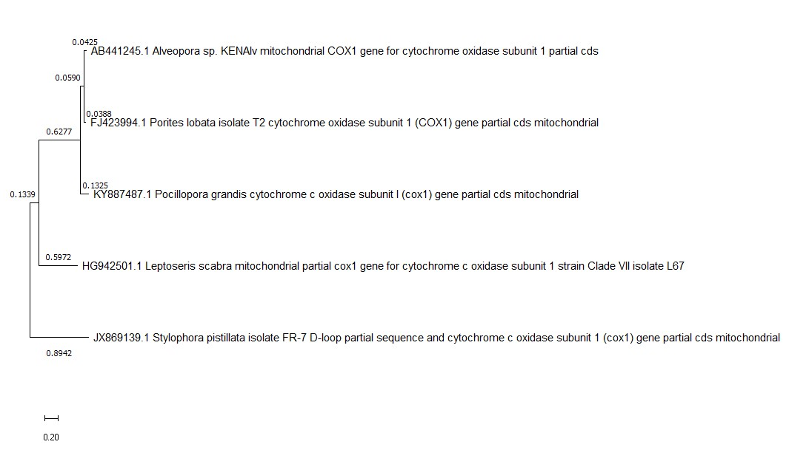

# **Phylogenetic tree for key target hard corals genera in my research** 

## Participating corals: 

- *Pocillopora spp.*
- *Stylophora spp.*
- *Porites spp.*
- *Leptoseris spp.*
- *Alveopora spp.* 

## Gene selected: Mitochondrial gene COX1

## Phylogenetic tree for key target corals: 

