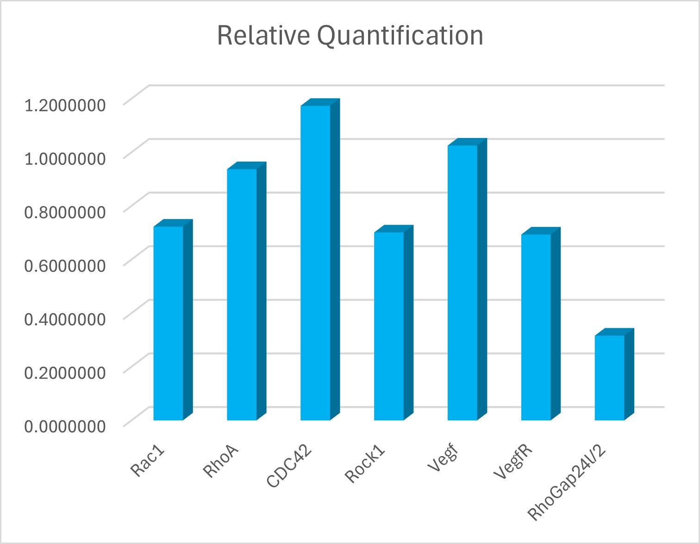

## 2024-07-07-The Delta-Delta Ct Method

1. Obtain Ct Values:

|**Cycle Threshold (Ct)**|||||||||
| :-: | :- | :- | :- | :- | :- | :- | :- | :- |
| |**ubi**|**Rac1**|**RhoA**|**CDC42**|**Rock1**|**Vegf**|**VegfR**|**RhoGap24l/2**|
|**DMSO Control**|20\.72|25\.65|29\.13|28\.45|28\.28|29\.71|28\.61|29\.48|
|**Inhibitor treatment** |19\.89|25\.34|28\.41|27\.38|28\.01|28\.85|28\.36|30\.45|

2. Calculate ΔCt (Delta Ct):

|**Delta Cycle Threshold (Ct)**|||||||||
| :-: | :- | :- | :- | :- | :- | :- | :- | :- |
| |**Rac1**|**RhoA**|**CDC42**|**Rock1**|**Vegf**|**VegfR**|**RhoGap24l/2**||
|**DMSO Control**|4\.9371|8\.4113|7\.7329|7\.5617|8\.9919|7\.8967|8\.7646||
|**Inhibtior treartment** |5\.4432|8\.5128|7\.4840|8\.1150|8\.9531|8\.4674|10\.5589||

3. Calculate ΔΔCt (Delta Delta Ct):  

|**Delta Delta Cycle Threshold (Ct)**|||||||||
| :-: | :- | :- | :- | :- | :- | :- | :- | :- |
| |**Rac1**|**RhoA**|**CDC42**|**Rock1**|**Vegf**|**VegfR**|**RhoGap24l/2**||
|**DMSO Control**|0\.5060745|0\.1014473|-0.2489222|0\.5532710|-0.0388337|0\.5706133|1\.7943234||

4. Calculate Relative Quantification (Fold Change):

|**Delta Delta Cycle Threshold (Ct)**|||||||||
| :-: | :- | :- | :- | :- | :- | :- | :- | :- |
||**Rac1**|**RhoA**|**CDC42**|**Rock1**|**Vegf**|**VegfR**|**RhoGap24l/2**||
||0\.7226532|0\.9369603|1\.1732430|0\.7010899|1\.0252388|0\.6933292|0\.3161010||

