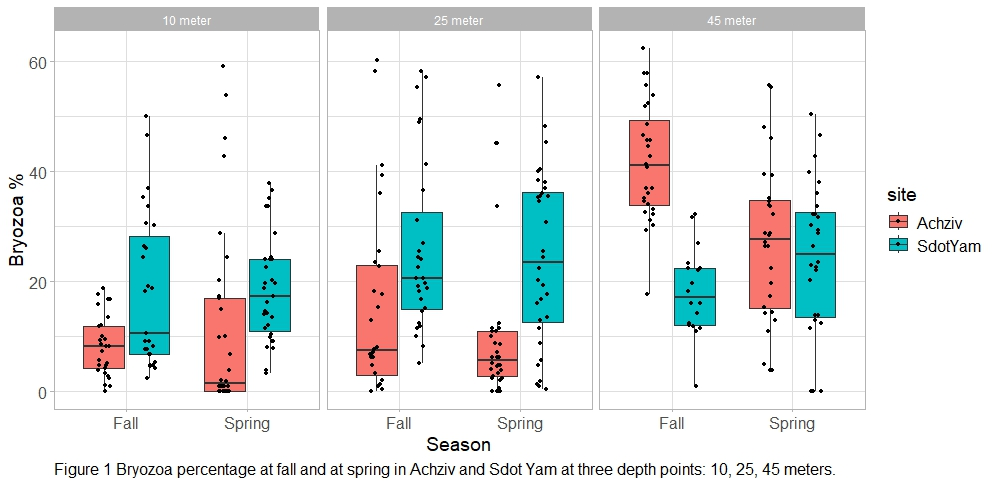
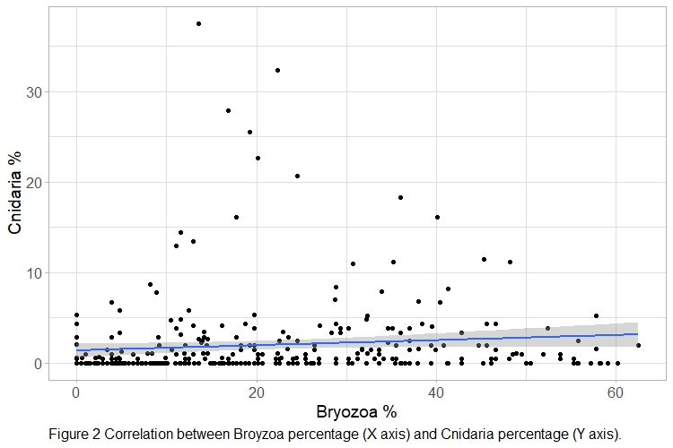
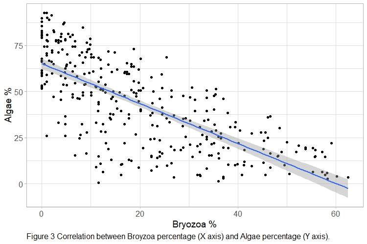

2024-07-17-Tamar\_Photosurvey\_results

**Taxonomy group: Bryozoa**

**Methodology:**

Examination of *Bryozoa* taxonomic group in two sites off the Israeli coast: Achziv and Sdot-Yam between the years 2016-2023 was done. Data sourced from the biannual (done in fall & in spring) photo survey conducted by the monitoring program of marine invertebrates of “Morris Kahn Marine Research Station” in Sdot Yam (<https://med-lter.haifa.ac.il/database-hub/>). 

*Bryozoans* coverage percentage was calculated, analysed statistically and plotted for visual presentation. Additionally, the correlations of the *Bryozoa* group with two other groups: algae and *Cnidaria* were examined. All results are presented below. 
   
   Input data files attached: 
Photosurvey\_metadata.csv, Photosurvey\_processed\_data.csv and 
R script document. Output data attached: correlations results data file: Taxonomic\_groups\_spearman.csv 

**Statistical analyses:**

In order to test homogeneity of variances in the Bryozoan group among sites, Bartlett test was conducted in R, using library ‘stats’ (v4.3.3) function ‘bartlett.test’. Differences were considered significant for P value <0.05.

In order to test for significance in the non-parametric *Bryozoan* group coverage data, an Art-Anova test was conducted in R, using library ‘ARTool’ (v0.11.1) function 'art'. Differences were considered significant for P value <0.05.

In order to graphically represent percentage of *Bryozoan* coverage proportions, by seasons, sites, and depth-points, box plot was created to all *Bryozoa* group data, using package ‘ggplot2’ (v3.5.0) (Figure 1).

In order to test for relatedness between coverage of the *Bryozoa* group with two other groups, a “Spearman” non-parametric correlation test was conducted in R, using package ‘Hmisc’ (v5.1-3) function ‘rcorr’. P- value adjustment was done in the “Benjamini-Hochber” method (BH) using library ‘stats’ (v4.3.3) function ‘p.adjust’. Differences were considered significant for P value <0.05.

The two groups of my interest were: firstly, algae since algae competing on the same substrate as the *Bryozoans* to settle upon, therefore I will expect to receive negative correlation between them. The second group is *Cnidaria*. A group that similarly to the *Bryozoa* group, needs a hard substrate to settle, but not in such large-scale as the algae, so this group would not be in competition. Therefore I will expect to receive positive correlation in this case.

In order to graphically represent the correlations between the coverage percentage of the *Bryozoa* and the algae group, and the *Bryozoa* and the *Cnidaria* group correlations plots (Figure 2 & 3) were created, using package ‘ggplot2’ (v3.5.0).

All statistical analyses and plots designing done with R software and R studio (ver4.3.3 February 2024).

**Results:**

Bartlett test for homogeneity of variances showed significance differences of the *Bryozoan* group coverage among sites: 

Bartlett's K-squared = 12.803, df = 1, p-value = 0.000346.

Since there is no homogeneity, a non-parametric ART-Anova statistical test was used. The results of the ART-Anova test for differences in coverage of the *Bryozoa* group with respect to the three main variables: site, season and depth-points, and all interactions between them showed significant differences across all (Table 1). 

The strongest influence was for the depth factor (F=41.57, p-value<2.22e-16). As can be seen at Figure 1. Especially at the depth of 45 m, in both sites and seasons, a totally different pattern of the coverage was demonstrated. The site factor was the second to affect the coverage, and then the season factor (F=8.29, p-value=0.0042 and F=4.34, p-value=0.038 respectively). From the interactions, the strongest was the interaction of the site\*depth (F=31.76, p-value<2.45e-13). Followed by the one between site\*season and lastly, between depth\*season (F=13.01, p-value=0.0003 and F=3.13, p-value=0.045 respectively). The interaction of the three factors site\*depth\*season was relatively low (F=4.51, p-value=0.01).

||Df|Df.res|F value|Pr(>F)|||
| :- | :- | :- | :- | :- | :- | :- |
|site|1|328|8\.2924|0\.00424282||\*\*|
|depth|2|328|41\.575|< 2.22e-16||\*\*\*|
|season|1|328|4\.3445|0\.0379014||\*|
|site:depth|2|328|31\.766|2\.45E-13||\*\*\*|
|site:season|1|328|13\.0131|0\.00035749||\*\*\*|
|depth:season|2|328|3\.1264|0\.04518371||\*|
|site:depth:season|2|328|4\.6156|0\.01054789||\*|
|
Signif. codes:   0 ‘\*\*\*’ 0.001 ‘\*\*’ 0.01 ‘\*’ 0.05 ‘.’ 0.1 ‘ ’ 1

**Table 1 ART-Anova test results for Bryozoan group by site, season, and depth points.**
|||||||

The results of the correlation test between the cover percentage of the Bryozoa group with the Cnidaria group, showed correlation exists (p-value=1.46E-07) and it was positive as expected. The magnitude of the correlation was low (0.296 Table 2). Nevertheless, it is supporting the assumption made that since Cnidarians and Bryozoans are using the same substrate in order to settle and grow, and once hard substrate is present there would be enough space for sessile organisms from few taxa to settle (Figure 2).

The results of the correlation test between the cover percentage of the *Bryozoa* group with the one of the algae, showed correlation exists (p-value=0) and was negative as expected. The magnitude of the correlation was strong (-0.742 Table 2), which strongly support the assumption made that since algae is competing on the same substrate in order to settle and grow, there would be less space for sessile organisms like the *Bryozoans* to settle upon, so where high precent of algae, will lower the coverage of the Bryozoans (Figure 3).

|row|column|correlation|p|p. adjusted|
| :- | :- | :- | :- | :- |
|Algae|Bryozoa|-0.74168|0|0|
|Algae|Cnidaria|-0.37141|1\.46E-12|1\.42E-11|
|Bryozoa|Cnidaria|0\.296745|2\.44E-08|1.46E-07|

**Table 2 Correlations between Bryozoa to the algae and Cnidaria groups and between the Cnidaria-algae groups.**

